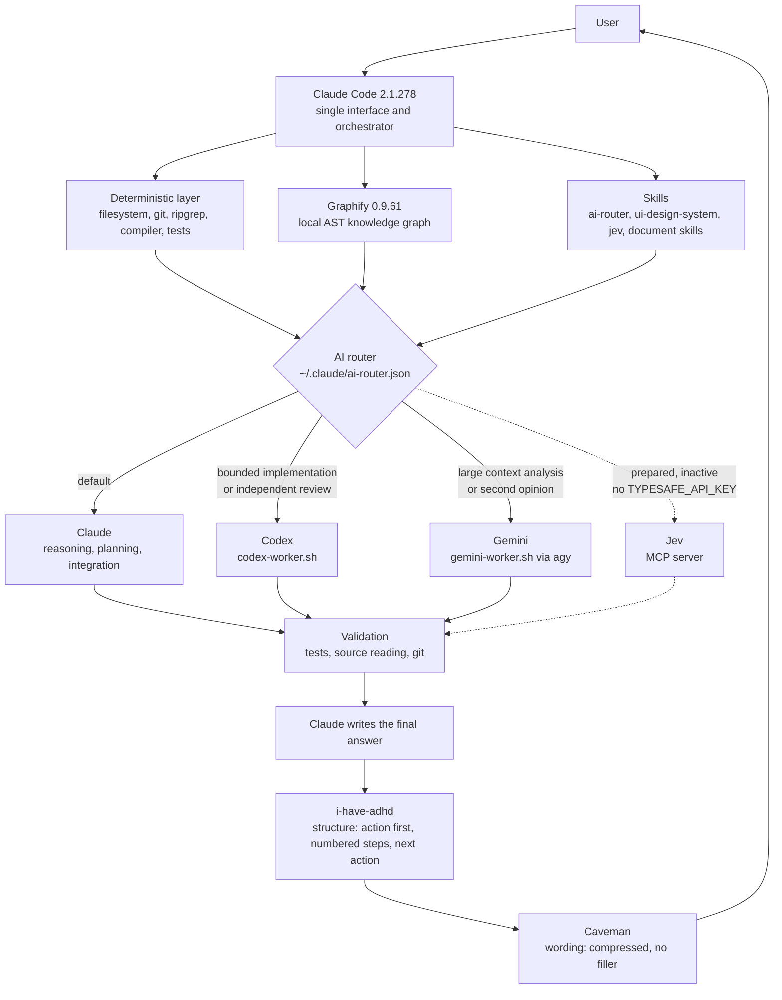

<div align="center">

# Claude Multi-Model Orchestrator

**One interface. Several engines. Nothing called unless it earns its place.**


Documentation of the real Claude Code orchestration layer installed on my Mac:
router, workers, skills, hooks, billing guard, privacy rules and recovery.

</div>

---

## What this repository is

Documentation only. No code from `~/.claude` is mirrored here, no credentials, no keys,
no employer material, no generated caches. This repository exists so that future me can
rebuild and reason about the setup without reverse engineering a dotfile tree.

Configuration state documented here was read from the live machine on **2026-09-22**.

## The promise

| Question | Answer |
|---|---|
| How do I start working? | `claude`. That is the whole interface. |
| Who decides what runs? | Claude Code, following the `ai-router` policy. |
| Does launching Claude spend Codex or Gemini quota? | No. Availability is a local check, never a call. |
| Can a fallback silently bill an API? | No. Metered API fallback is disabled and enforced by the worker wrappers. |
| Where does architecture knowledge come from? | Graphify, built locally from the AST, before broad file reading. |
| Who owns the final answer? | Claude. A worker result is a proposal, never truth. |

## Core rule

> **AUTO-AVAILABLE is not AUTO-CALLED.**

Codex, Gemini and Jev are wired in and idle. Startup loads instructions and calls nothing:
zero Codex, zero Gemini, zero Jev, zero metered API. A worker runs only when routing selects it,
and routing only selects it when delegation buys quality, independence or parallelism.

## Normal workflow

```
claude
```

Claude Code then decides, in this order, to:

1. answer with a deterministic tool (filesystem, git, ripgrep, compiler, tests, Graphify)
2. do the work directly
3. activate a skill that fits the task
4. delegate one bounded subtask to Codex or Gemini
5. ask a model that did not write the code to review it
6. use Jev for bounded semantic classification, once a TypeSafe key exists

## Architecture



The dotted path is Jev: installed locally, registered as an MCP server, and unavailable today
because no TypeSafe key exists in the Keychain. Nothing depends on it.

## Documentation kit

| File | Content |
|---|---|
| [docs/architecture.md](docs/architecture.md) | Layers, real file paths, what runs where |
| [docs/routing.md](docs/routing.md) | Decision hierarchy, modes, fallback, loop protection |
| [docs/workers.md](docs/workers.md) | Claude, Codex, Gemini, Jev: real invocation and guards |
| [docs/skills.md](docs/skills.md) | Every installed skill, trigger and activation mode |
| [docs/hooks.md](docs/hooks.md) | The hooks that run automatically, and why a hook is not a skill |
| [docs/billing.md](docs/billing.md) | Subscription-only policy, no surprise API fallback |
| [docs/security.md](docs/security.md) | Secrets, privacy, repository safety, worker scoping |
| [docs/troubleshooting.md](docs/troubleshooting.md) | Failure modes and how each one degrades |
| [docs/restore.md](docs/restore.md) | Rebuilding the architecture on another Mac |
| [diagrams/architecture.md](diagrams/architecture.md) | Diagrams: routing, session start, billing guard |
| [examples/routing-examples.md](examples/routing-examples.md) | Concrete tasks and the route each one takes |

## Doctrine

1. Deterministic tools before models. If ripgrep answers it, no model runs.
2. Claude before delegation. A three line task stays a three line task.
3. Delegation must buy something: independence, parallelism, saved context, better quality.
4. The smallest sufficient combination wins. The goal is never "use every AI".
5. Claude owns intent, repository state, verification and the final answer.
6. No metered API is ever reached automatically.
7. Nothing confidential leaves the machine.

## Known limits

- Jev is inactive. Availability shows `false` until a TypeSafe key is added to the Keychain.
- The hosted `gemini` CLI is dead for personal accounts since 2026-06-18. Routing uses `agy`
  (Antigravity CLI) instead. The old binary is still on disk and only returns a tier error.
- `docs/billing.md` in the live skill folder still describes Gemini as blocked by tier; the
  live capability file and the status probe are the current source of truth. Noted in
  [docs/workers.md](docs/workers.md).
- Graphify does not parse notebooks, config semantics, registry dispatch or injected
  collaborators. The graph says where to look; source and tests decide.
- This repository is documentation, not an installer. Restore is a manual checklist.

## Licensing

No open source license is granted. The setup described here wires together third-party tools
(Claude Code, Codex CLI, Antigravity CLI, Graphify, Jev, community plugins) that keep their own
licenses. Relicensing them would be wrong, so this repository stays private and reserved.
See [LICENSE](LICENSE).

---

<div align="center">

Private personal infrastructure documentation. Nothing here is a credential.

</div>
