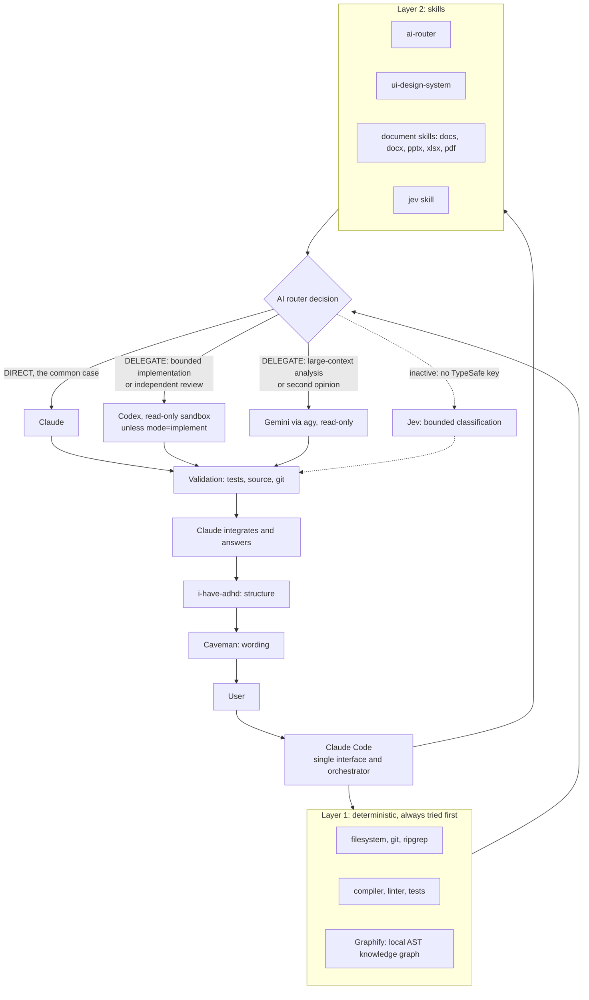
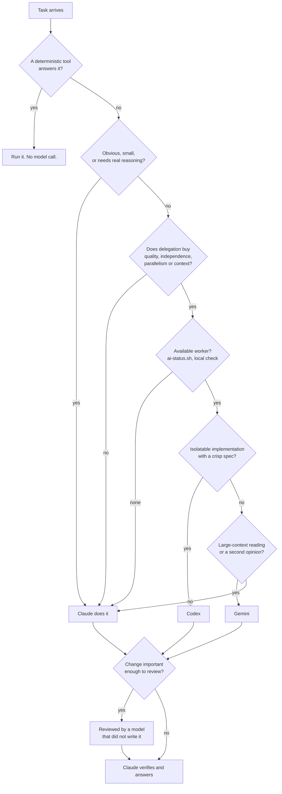
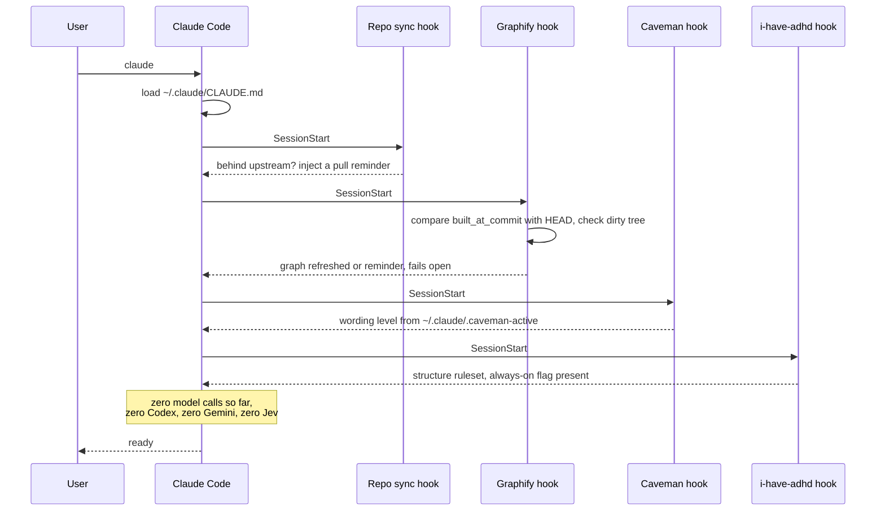
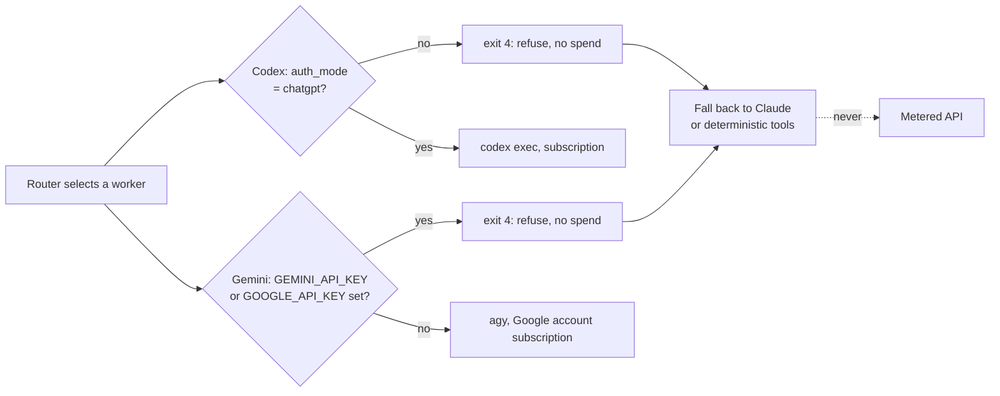

# Diagrams

## 1. Full stack

```mermaid
flowchart TD
    U[User] --> CC["Claude Code<br/>single interface and orchestrator"]

    subgraph L1["Layer 1: deterministic, always tried first"]
        FS[filesystem, git, ripgrep]
        TB[compiler, linter, tests]
        GR["Graphify: local AST knowledge graph"]
    end

    subgraph L2["Layer 2: skills"]
        AR[ai-router]
        UI[ui-design-system]
        DOC["document skills: docs, docx, pptx, xlsx, pdf"]
        JS[jev skill]
    end

    CC --> L1
    CC --> L2
    L1 --> R{AI router decision}
    L2 --> R

    R -->|DIRECT, the common case| CL[Claude]
    R -->|DELEGATE: bounded implementation<br/>or independent review| CX["Codex, read-only sandbox<br/>unless mode=implement"]
    R -->|DELEGATE: large-context analysis<br/>or second opinion| GM[Gemini via agy, read-only]
    R -.->|inactive: no TypeSafe key| JV["Jev: bounded classification"]

    CL --> V["Validation: tests, source, git"]
    CX --> V
    GM --> V
    JV -.-> V

    V --> FIN[Claude integrates and answers]
    FIN --> AD["i-have-adhd: structure"]
    AD --> CV["Caveman: wording"]
    CV --> U
```

## 2. Routing decision

```mermaid
flowchart TD
    T[Task arrives] --> D1{"A deterministic tool<br/>answers it?"}
    D1 -->|yes| DET[Run it. No model call.]
    D1 -->|no| D2{"Obvious, small,<br/>or needs real reasoning?"}
    D2 -->|yes| CLA[Claude does it]
    D2 -->|no| D3{"Does delegation buy<br/>quality, independence,<br/>parallelism or context?"}
    D3 -->|no| CLA
    D3 -->|yes| D4{"Available worker?<br/>ai-status.sh, local check"}
    D4 -->|none| CLA
    D4 -->|yes| D5{"Isolatable implementation<br/>with a crisp spec?"}
    D5 -->|yes| CX[Codex]
    D5 -->|no| D6{"Large-context reading<br/>or a second opinion?"}
    D6 -->|yes| GM[Gemini]
    D6 -->|no| CLA
    CX --> REV{"Change important<br/>enough to review?"}
    GM --> REV
    CLA --> REV
    REV -->|yes| IR["Reviewed by a model<br/>that did not write it"]
    REV -->|no| OUT[Claude verifies and answers]
    IR --> OUT
```

## 3. Session start

```mermaid
sequenceDiagram
    participant U as User
    participant CC as Claude Code
    participant H1 as Repo sync hook
    participant H2 as Graphify hook
    participant H3 as Caveman hook
    participant H4 as i-have-adhd hook

    U->>CC: claude
    CC->>CC: load ~/.claude/CLAUDE.md
    CC->>H1: SessionStart
    H1-->>CC: behind upstream? inject a pull reminder
    CC->>H2: SessionStart
    H2->>H2: compare built_at_commit with HEAD, check dirty tree
    H2-->>CC: graph refreshed or reminder, fails open
    CC->>H3: SessionStart
    H3-->>CC: wording level from ~/.claude/.caveman-active
    CC->>H4: SessionStart
    H4-->>CC: structure ruleset, always-on flag present
    Note over CC: zero model calls so far,<br/>zero Codex, zero Gemini, zero Jev
    CC-->>U: ready
```

## 4. Billing guard

```mermaid
flowchart LR
    W[Router selects a worker] --> G1{"Codex: auth_mode<br/>= chatgpt?"}
    G1 -->|no| X1["exit 4: refuse, no spend"]
    G1 -->|yes| RUN1[codex exec, subscription]

    W --> G2{"Gemini: GEMINI_API_KEY<br/>or GOOGLE_API_KEY set?"}
    G2 -->|yes| X2["exit 4: refuse, no spend"]
    G2 -->|no| RUN2[agy, Google account subscription]

    X1 --> FB["Fall back to Claude<br/>or deterministic tools"]
    X2 --> FB
    FB -.->|never| API[Metered API]
```
